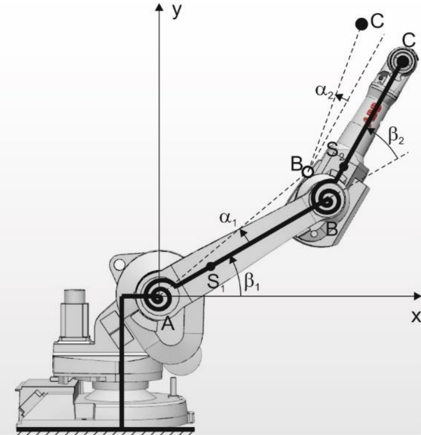

# Vibsnake's src

## Análise analítica

O cálculo analítico da cadeia robótica foi baseado no artigo de

PIETRUŚ, P., & GIERLAK, P. (2020).
**Influence of the manipulator configuration on vibration effects.**
[DOI 10.2478/ama-2023-0060](https://sciendo.com/pdf/10.2478/ama-2023-0060) 

### Teoria

Os autores se basearam na abordagem de energias para obter a equação de movimento 

$ M \ddot{\alpha} + C \dot{\alpha} + K \alpha = 0 $ 

do robô de duas juntas planares, apresentado na figura.

    <figure>
        
        <figcaption> Manipulador plano de dois links com juntas flexíveis analisado no artigo de referência
    </figure>

Para resolver a equação, os termos de amortecimento foram descartados, por causa de sua baixa influência no valor das frequências naturais da estutura, além de simplificar o cálculo, obtendo,

$M \ddot{\alpha} + K \alpha = 0,$

o qual é um problema de autovalor e autovetor, resolvido por,

$A \vec{x} = \lambda \vec{x},$

com solução,

$det(-\omega^2 M + K) = 0.$

### Uso do código

O arquivo principal do código analítico é [MZ_analytical_freq.py](./MZ_analytical_freq.py), o qual usa as funções presentes no arquivo [MZ_func.py](./MZ_func.py). Para o cálculo são fornecidas as seguintes definições em formato de lista para a função freq_calculation;
- Número de links;
- Momentos de inércia dos links;
- Massa dos links;
- Comprimento dos links;
- Centro de massa dos links;
- Posição de cada link;
tendo como saída da função as listas de frequências naturais em rad e Hz.

> Todas as definições de projeto podem ser obtidas facilmente por ferramentas CAD.

## Tratamento de FFT

## Outro códigos

1. [Teorema_Nyquist_teste.py](./Teorema_Nyquist_teste.py) → 